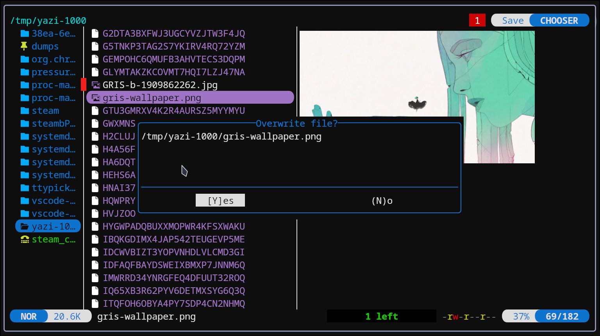

# filechooser.yazi

This plugin makes file choosing with Yazi more user-friendly. Features include:
- Overwrite confirmation dialog
- Header providing file chooser mode (Open or Save)
- Notification of invalid selection



## Contents
  - [Prerequisites](#prerequisites)
  - [Installation](#installation)
  - [Configuration](#configuration)
    1. [Add setup function in `~/.config/yazi/init.lua`](#1-add-setup-function-in-configyaziinitlua)
    2. [Add or replace keymap for 'open' action in `~/.config/yazi/keymap.toml`](#2-add-keymap-in-configyazikeymaptoml)
  - [Advanced](#advanced)

## Prerequisites

- An XDG Desktop FileChooser backend to trigger Yazi filechooser mode
    - Linux Option 1: any variant of xdg-desktop-portal-termfilechooser, such as [boydaihungst](https://github.com/boydaihungst/xdg-desktop-portal-termfilechooser) or [hunkyburrito](https://github.com/hunkyburrito/xdg-desktop-portal-termfilechooser)
    - Linux Option 2 (recommended): [ttypicker](https://github.com/olibrks/ttypicker) a new Rust-based asynchronous FileChooser backend which gives more information to this plugin for directory and multiple selection.


## Installation

```sh
ya pkg add olibrks/filechooser
```

## Configuration

### 1. Add setup function in `~/.config/yazi/init.lua`

All the options are optional, but the setup function itself is required.

```lua
require("filechooser"):setup{
  -- Enable overwrite confirmation dialog when saving as an existing file (default enabled)
  overwrite_dialog = true,
  -- Minimum number of files to trigger opening confirmation dialog (default diabled: 0)
  open_multi_dialog = 5,
  -- Enable the display of the chooser file mode in the top right corner (default enabled)
  header = true,
  -- Enable yanking the save placeholder file (default enabled)
  yank_save_dummy = true,
}
```

### 2. Add keymap in `~/.config/yazi/keymap.toml`

> [!IMPORTANT]
> As Yazi in filechooser mode will select files opened with any non-interactive "open" action, you must replace the default keymaps `o` and `<Enter>` to use the plugin instead.

```toml 
[mgr]
prepend_keymap = [
# Open or select files
    { on = "<Enter>", run = "plugin filechooser -- --smart", desc = "Enter the hovered directory, or open/choose the hovered file" },
    { on = "o", run = "plugin filechooser", desc = "Open/choose the selected files or folders, or the hovered one if non selected" },
]
```
> [!TIP]
> If you are using the popular [smart-enter](https://github.com/yazi-rs/plugins/tree/main/smart-enter.yazi) plugin, add `--smart` argument, as shown above with `<Enter>`.

## Advanced

### Theming
Optionally, you can theme the header by defining `[chooser].mode_main` and `[chooser].mode_alt` as Styles in your `flavor.toml` or `theme.toml`. Default is `[mode].normal_main`/`normal_alt`.

```toml
[chooser]
mode_main = { bg = "blue", bold = true }
mode_alt  = { fg = "blue", bg = "gray" }
```